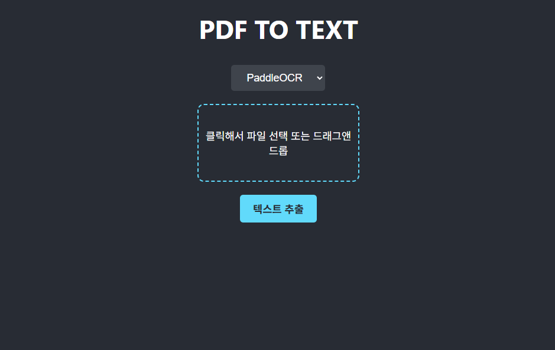
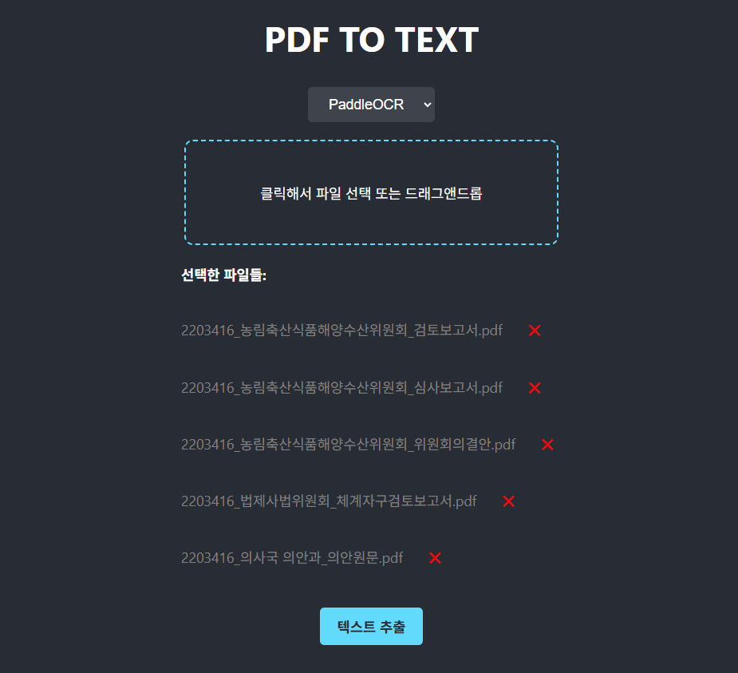
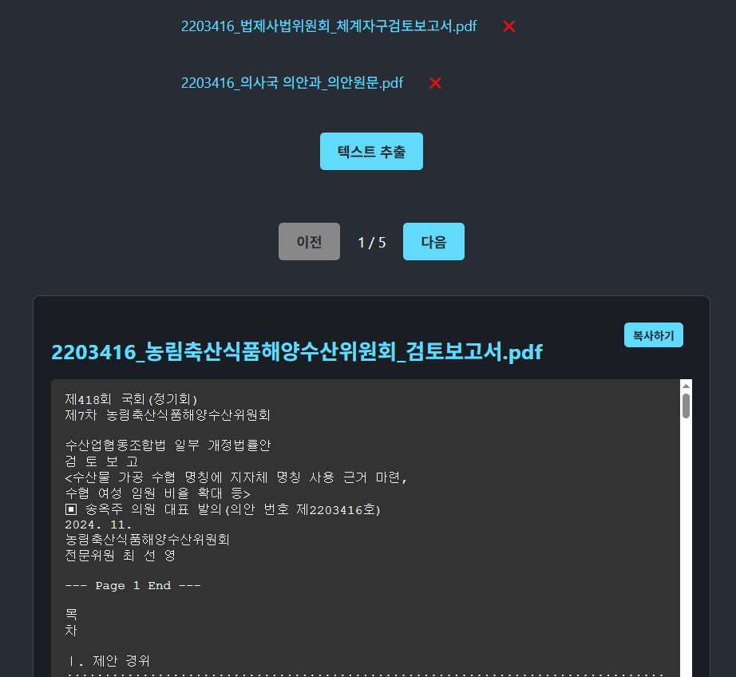
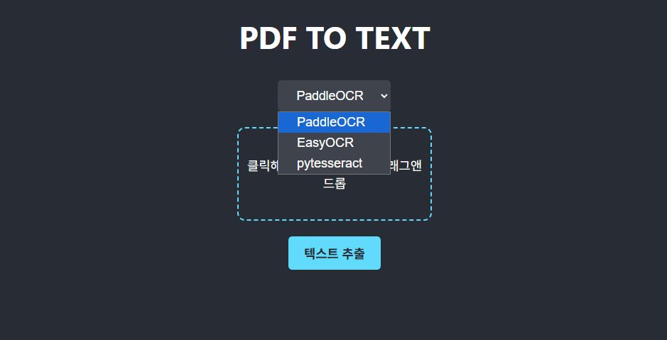

# OCR Hub


## 개요



* 클릭하거나 드래그앤드롭하여 파일을 등록하고




* 텍스트 추출 버튼을 눌러 pdf에서 텍스트를 추출할 수 있습니다.





* 3가지의 OCR 방식을 선택할 수 있습니다.




## 실행


### 1. 프론트엔드 설치 및 실행

```bash
cd front
npm install
npm start
```

브라우저에서 `http://localhost:3000` 접속

------

### 2. OCR 엔진 설치

각 OCR 엔진을 GitHub에서 클론 후, 내부 README.md 지침에 따라 설치 및 실행:

- **pytesseract**
  - [GitHub](https://github.com/bangtugu/pytesseract-back) 참조
- **EasyOCR**
  - [GitHub](https://github.com/bangtugu/easyocr-back) 참조
- **PaddleOCR**
  - [GitHub](https://github.com/HJKim9810/paddle-back) 참조

```bash
git clone https://github.com/bangtugu/pytesseract-back.git
git clone https://github.com/bangtugu/easyocr-back.git
git clone https://github.com/HJKim9810/paddle-back.git
```

------

### 3. 포트 설정 (각 main.py 내부에 설정돼있음)

- pytesseract: `8000`
- EasyOCR: `8001`
- PaddleOCR: `8002`
- FE : `3000`


# 통합버전


### 개요

GPU를 사용할 경우 각 OCR에 대한 라이브러리 등 설정을 용이하게 하기 위해 환경을 격리할 필요가 있음.

하지만 낮은 GPU성능 환경이나 기타 요인에 의해 CPU만 사용할 경우 환경을 분리하지 않아도 된다.

하나의 백엔드 서버에서 모든 ocr을 사용할 수 있는 통합버전

**통합버전**

- [GitHub](https://github.com/HJKim9810/paddle-back) 참조